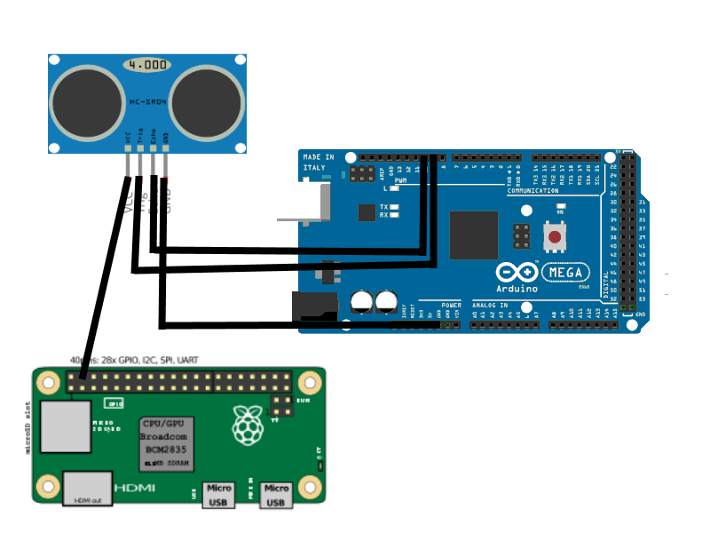
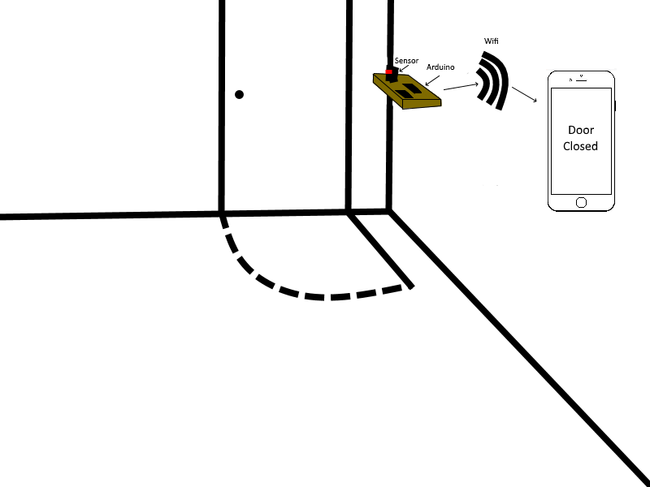

# SmartDoor
SmartDoor using arduino + raspberry pi

## Physical Setup
I used a RaspberryPi Zero W and an Arduino Mega to set it up:



## How to Setup
First you'll have to upload the arduino program on the arduino folder to your arduino.
Yen you can use this commands to set it up.
```shell
sudo apt-get install screen
sudo git clone https://github.com/iByNiki/SmartDoor/
sudo cd SmartDoor
sudo chmod -R 777 *
sudo apt-get install python3
sudo python3 -m pip3 install PySerial
sudo apt-get install apache2
sudo apt-get install php libapache2-mod-php
sudo cd website
sudo mv * /var/www/html/
sudo echo 1 >> /var/www/html/distances.txt
sudo cd ../raspberry
sudo screen -S SmartDoor
sudo python3 smartdoor.py
```
